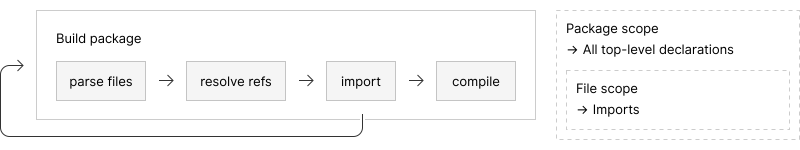
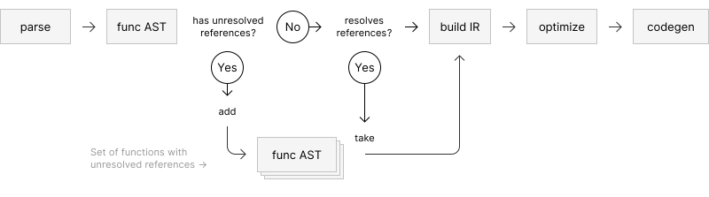

# Documentation

### [Language specification](spec.html)

A slightly outdated document that will eventually be broken into
smaller pieces.

## Architecture

Code is structured into packages where a package can import other packages
to make use of their code and data.
A package is usually built from a number of source files, though source code
need not be coming from files.
Each package has its own namespace which holds all declarations, independently
of where the declarations appear (i.e. source files.)

A package is built in a pipeline fashion, where each source file is
concurrently processed.

The parser pipeline converts UTF8 data into abstract syntax trees.
It transforms bytes into tokens which are interpreted in a highly
syntax-aware fashion, producing AST structures that represent the program
in a lossless format.

The compiler pipeline operates at the granularity of functions and is mostly
focused on Intermediate Representation (IR) code.
An IR builder takes a function in AST form and builds a set of basic blocks
in SSA form to represent the function at a essentially language-agnostic level.
Optimizations are applied to the IR as a sequence of "passes", where some are
always enabled and some are only enabled when "optimized" code is requested,
trading time for code quality.

The IR builder is somewhat language-aware, as it converts AST into IR, but
subsequent oprimization passes and code generation is language-agnostic and
it would be possible to make use of this "back end" for other languages with
similar runtime semantics to Co.

An unresolved reference is an identifier which is unavailable or unknown at
the time it is referenced. Usually this identifier is defined later in code,
or in a separate source file. Anyhow, the compiler will stuff away functions
which has unresolved references into a "wait set".
Whenever an identifier is defined which causes a previously-unresolved
function to become resolved (i.e. when all its references are known), that
function is lifted out from the "wait set" and is compiled to completion.

The parser and compiler pipeline makes use of some shared resources:

- Parser is a reusable resource that can parse source code from a list of bytes.
- Universe represents built-in types and values and is shared amongst all
  parsers.
  - String set holds interned byte strings, allowing identifiers to internally
    be referenced by pointers rather than strings.
  - Type set holds interned user-type definitions, allowing types to internally
    be identified by pointers.
- Type resolver is a reusable resource for resolving types from AST.
  It is allocated on a per-package basis.
- IR builder is a resource that can either be provided with a parser
  allocation for online building of IR,
  or used separately to build IR from AST.
- Package binder completes cross-references inside a package and manages
  importing of other packages. It can be run online by the parser,
  or as a separate step on AST.

## Topics

[Intermediate representation (IR)](ir.html) — details on how code is
  represented internally and how SSA is used for optimizations.

[Call stack](stack/) — discusses the call stack

[Patterns](patterns.html) —
  Observations of common patterns in general programming and inspiration for Co

[Chaitin-Briggs register allocation demo](chaitin/) —
  visualization of the Chaitin-Briggs graph-coloring register allocation
  algorithm.
