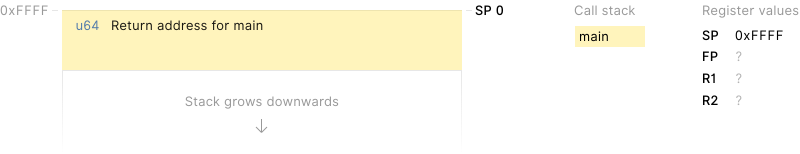
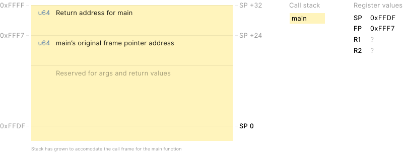
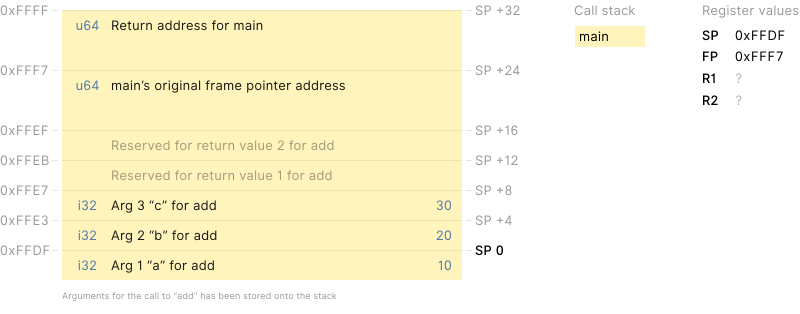
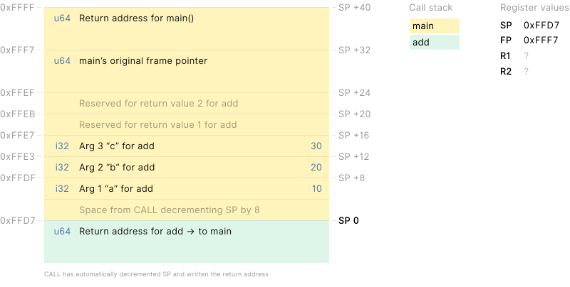
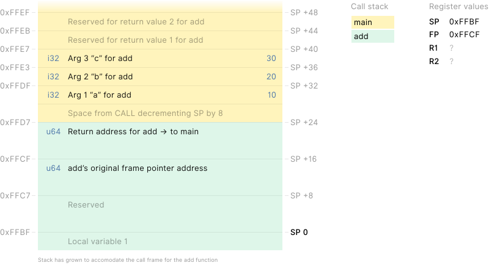
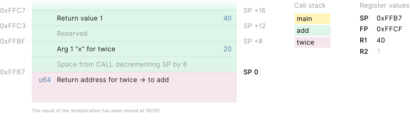
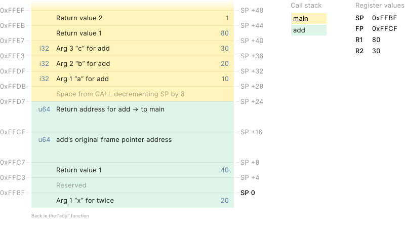

# Call stack

To understand how Co's call stack works, let's explore a simple program:

```erl
fun twice(x i32) i32 {
  x * 2
}

fun add(a, b, c i32) (i32, bool) {
  b = twice(b)
  (a + b + c, true)
}

fun main {
  add(10, 20, 30)
}
```

Before we dig in, let's define some terminology:

- **FP**: Frame pointer — arguments and locals (aka "BP")
- **IP**: Instruction pointer — jumps and branches (aka "PC")
- **SB**: Static base pointer — globals
- **SP**: Stack pointer — top of stack

This example assumes an intel-like architecture with 64-bit (8 byte) addressing.

When our `main` function is called, a return address has been placed on top
of the stack, the stack pointer (SP) has been adjusted to point to the top
of the stack, and the instruction pointer (IP) is pointing at the first
instruction of our main function:



`SP` is the _stack pointer_—a register value that is used to refer to the
current address in the stack memory. We use this value to address nearby
values in the current _stack frame._

The `main` function first grows the stack to make room for
frame pointer address, call arguments and return values:

```s
SUBQ  $32, SP     # grow stack
MOVQ  FP, 24(SP)  # store frame-pointer in stack memory at SP+24
LEAQ  24(SP), FP  # load new frame pointer addr into FP (excl return address)
```



{: .sidenote}
> In these illustrations, the number next
> to `SP` indicates an offset from `SP`, for instance `SP +4` means
> "SP plus 4 bytes" and is written as `4(SP)` in code.

Since stack memory is pre-allocated, "growing" the stack really just means
to change the value of `SP`.
As the stack grows, the stack pointer (SP) _decreases_ in value.

Next, `main` writes the arguments to the `add` function we're about to call:

```s
MOVL  $10, (SP)   # store arg 1 for "add" on stack at 0xFFDF (= SP +0)
MOVL  $20, 4(SP)  # store arg 2 for "add" on stack at 0xFFE3 (= SP +4)
MOVL  $30, 8(SP)  # store arg 3 for "add" on stack at 0xFFE7 (= SP +8)
```



{: .sidenote data-ref='img[alt="stack03"]'}
> Why didn't we decrement SP to include 4 bytes extra bytes for Arg 1?
>
> Intel-like architectures automatically decrements SP by the address size
> before it writes the return address to SP, thus we have 8 bytes
> of space in the stack after SP.


```s
CALL  add(SB)  # call the "add" function
```



The `CALL` instruction performs the following:

1. Increment IP (instruction pointer)
2. Subtract 8 from SP (8 = address size)
3. Copy IP to address stored at SP —
   this effectively writes the return addressat SP; the program-memory address
   just after our CALL instruction (value of IP.)
4. Set IP to address given with CALL operand (`add(SB)`)

CALL can be substituted by the following code:

```s
SUBQ  $8 SP       # grow stack to accomodate return address
LEAQ  16(IP) (SP) # store return address on stack at SP+0
MOVQ  add(SB) IP  # load destination address into IP
```

We're now in the `add` function which does the same thing that the `main`
function did in it's "prologue", namely to grow the stack and save its
frame pointer:

```s
SUBQ  $24, SP     # grow stack
MOVQ  FP, 16(SP)  # store frame-pointer in stack memory at SP+16
LEAQ  16(SP), FP  # load new frame pointer addr into FP (excl return address)
```



```s
MOVL  b+36(SP), R1  # load add's 2nd arg into register R1
MOVL  R1, (SP)      # store arg 1 for "twice" on stack at 0xFFBF (= SP +0)
```


```s
CALL  twice(SB)  # call the "twice" function
```


```s
MOVL  8(SP), R1
SHLL  $1, R1       # shift left ("x * 2" optimized to "x << 1")
MOVL  R1, 16(SP)
```



```s
RET  # return to caller
```

The `RET` instruction performs the following:

1. Copy the value of SP to IP so that execution continues after the CALL
   instruction in the calling function.
2. Add 8 to SP (8 = address size) to effectively "pop" the return address
   off the stack.

RET can be substituted by the following code:

{: #s-code-ret}
```s
ADDQ $8 SP      # shrink stack beyond return address
LEAQ -8(SP) IP  # load return address into IP
```

{: .sidenote data-ref="#s-code-ret"}
> On architectures without LEA, we would have to temporarily
> store the value of SP into another register while shrinking the stack:<br>
> `MOVQ (SP) R1`<br>
> `ADDQ $8 SP`<br>
> `MOVQ SP IP`


After RET, execution continues in the calling function.

We can now use the result from the call to "twice" to complete our
calculations in the "add" function:

```s
MOVL  32(SP), R1  # load argument a into R1
ADDL  8(SP), R1   # add return value of "twice" and b into R1
MOVL  40(SP), R2  # load argument c into R2
ADDL  R2, R1      # add result of previous addition and c into R1
```

Next we write the return values:

```s
MOVL  R1, 44(SP)  # store result of addition to stack at SP+44 (result 1)
MOVB  $1, 48(SP)  # store constant 1 to stack at SP+48 (result 2)
```



It's time to return to "main" from the "add" function:

```s
MOVQ  16(SP), FP  # restore frame pointer
ADDQ  $24, SP     # shrink stack back to where it was when we entered "add"
```


```s
RET  # return to caller
```


And that's it.

There's a lot of room for hardware-dependent optimizations, like passing
arguments and return values in registers instead of on the stack.

Another thing we probably will do is to get rid of the frame pointer
(FP) and free up that register for general use. FP is handy for
manual assembly but is not needed as we address the stack using only SP.


## Code listing

### twice function

```s
twice(SB) 0, 16
  MOVL  8(SP), R1       # load argument x into R1
  SHLL  $1, R1          # shift left ("x * 2" optimized to "x << 1")
  MOVL  R1, 16(SP)      # store result in R1 to stack at SP+16
  RET                   # return to caller
```

### add function

```s
add(SB), 24, 24
  SUBQ  $24, SP         # grow stack for call args + retvals + retaddr
  MOVQ  FP, 16(SP)      # store current frame pointer at SP+16
  LEAQ  16(SP), FP      # compute & store new frame pointer addr
  
  MOVL  36(SP), R1      # load add's 2nd arg b into register R1
  MOVL  R1, (SP)        # push arg 1
  
  CALL  twice(SB)       # call "twice" function

  MOVL  32(SP), R1      # load argument a into R1
  ADDL  8(SP), R1       # add return value of "twice" and b into R1
  MOVL  40(SP), R2      # load argument c into R2
  ADDL  R2, R1          # add result of previous addition and c into R1

  # store return values (for the current function)
  MOVL  R1, 44(SP)      # store result of addition to stack at SP+44 (result 1)
  MOVB  $1, 48(SP)      # store constant 1 to stack at SP+48 (result 2)

  # restore stack
  MOVQ  16(SP), FP      # restore frame pointer (unwind by one stack frame)
  ADDQ  $24, SP         # shrink stack (balances growth by SUBQ $24, SP)

  RET                   # return to caller
```

### main function

```s
main(SB), 32, 0
  SUBQ  $32, SP         # grow stack
  MOVQ  FP, 24(SP)      # store frame-pointer in stack memory at SP+24
  LEAQ  24(SP), FP      # load new frame pointer addr into FP

  MOVL  $10, (SP)       # store arg 1 for "add" on stack at 0xFFDF (= SP +0)
  MOVL  $20, 4(SP)      # store arg 2 for "add" on stack at 0xFFE3 (= SP +4)
  MOVL  $30, 8(SP)      # store arg 3 for "add" on stack at 0xFFE7 (= SP +8)

  CALL  add(SB)         # call the "add" function

  # restore stack
  MOVQ  24(SP), FP      # unwind stack pointer by one stack frame
  ADDQ  $32, SP         # shrink stack (balances growth by SUBQ $32, SP)

  RET                   # return to caller
```

Note: At function definitions like `add(SB), 24, 24`, the numbers means
"frame-size, args-size". This states that the function has a 24-byte frame
and is called with 24 bytes of argument, which live on the caller's frame.


### CALL emulation

```s
SUBQ  $8 SP       # grow stack to accomodate return address
LEAQ  16(IP) (SP) # store return address on stack at SP+0
MOVQ  add(SB) IP  # load destination address into IP
```

Note: `16(IP)` assumes the sum of the current instruction and the following
MOVQ instruction is a total of 16 bytes.


### RET emulation

```s
ADDQ $8 SP      # shrink stack beyond return address
LEAQ -8(SP) IP  # load return address into IP
```


## Notes

**LEA** stands for Load Effective Address (seen as `LEAQ` in the example code).

LEA, the only instruction on x86 that performs memory addressing calculations
but doesn't actually address memory.
LEA accepts a standard memory addressing operand, but does nothing more than
store the calculated memory offset in the specified register, which may be
any general purpose register.

What does that give us? Two things that ADD doesn't provide:

- the ability to perform addition with either two or three operands, and
- the ability to store the result in any register; not just one of the source operands
